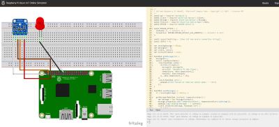
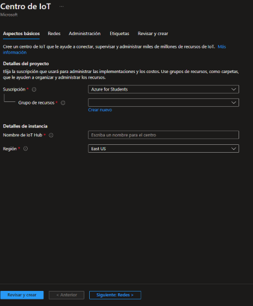
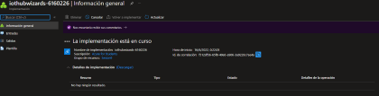
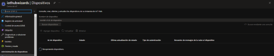

Primer practica: IoT Hub

1.- Vamos al [Portal Azure](portal.azure.com)

2.- Antes que nada vamos al simulador de Rasperry Pi Azure

3.- Buscamos Centro de IoT y creamos un servicio de centro IoT

3.- Llenamos los datos, le damos en revisar y crear.

4.- Cuando ya crea el recurso, no vamos al recurso.

5.- Ahora vamos a crear un dispositivo. Nos vamos a la seccion de dispositivos y creamos un dispositivo.

