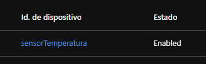

## IoT = Internet of Things

Es la conexion de las cosas.

**por ejemplo: maquinas-accionadores, sensore, etc.**

#### - Dentro de Azure, tenemos:

**IoT Hub, IoT Central,IoT Sphere**.

## IoT Sphere 
- Es para seguridad de los servicios de internet de las cosas.
- Establecen conexiones optimizadas para recibir informacion.
- *Solucion de software y hardware*.

## IoT Hub
- Es *IaaS*
- No tiene interfaz grafica
- Nos sirve para tener control total.
- Nos deja conectarnos a cualquier cosa que tenga internet.
- Podemos hacer cualquier cosa.
- **Sirve para conectar IoT a Azure**.

## IoT Central
- Es PaaS.
- Este si tiene interfaz grafica.
- Mas facilidad y rapidez. 
- Este nos da un *dashboard* **(un panel)** para tener mas facil conexion. 
- Este es mas para monitoreo y control limitado.

**IoT Hub** y **IoT Central**, estos dos mandan a llamar a otro servicio llamado **IoT Edge** es una conexion a un dispositivo.

------------------------------------------------------------------------------------------------------------------------

## Pasos para crear un IoT Hub

1.- Vamos al [Portal Azure](portal.azure.com)

2.- Antes que nada vamos al simulador de Rasperry Pi Azure

3.- Buscamos Centro de IoT y creamos un servicio de centro IoT

3.- Llenamos los datos, le damos en revisar y crear.

4.- Cuando ya crea el recurso, no vamos al recurso.

5.- Ahora vamos a crear un dispositivo. Nos vamos a la seccion de dispositivos y creamos un dispositivo.

6.- Creamos el dispositivo, donde solo le pondremos un nombre, lo demas lo dejamos tal cual esta.

7.- Le daremos click, sobre el nombre del dispotivo.

8.- Ahora, vamos a copiar el que dice **Cadena de conexion Principal**.

9.- Nos regresamos al simulador de Rasperry.

10.- Buscamos la parte que dice **Your IoT hub device connection string** y ahi pegamos la conexion.

11.- Cuando lo hagamos, le damos en Run. Lo que pasara es que el foco rojo, empezara a parpadear.

12.- Ahora usaremos la terminal de Azure Bash para escribir este comando **az iot hub connection-string show --hub-name iothubwizards --policy-name service**.

#### **Aca vamos a mostrar un conection String, que este va a recibir informacion**

**Nota: Siempre que pondremos comando con algo relacionado con Azure se pone siempre al principio *AZ***

13.- Esperamos a que nos deje, guardamos bien el link que nos da.

14.- Abrimos el CMD y lo primero que siempre se debe hacer es poner el comando ***az** para que reconozca los comando que pondremos.

15.- Ahora  obtendremos el consumer group **(que es para decirle a donde le mandamos la informacion)**.

16.- Pondremos el sguiente comando para obtener el consumer group **az iot hub consumer-group create--hub-name iothubwizards --name consumergroup**.

17.- Ahora en visual Code, creamos una nueva terminal y pondremos el comando **npm install**

18.- Cuando acabe de crearse, le voy  aponer el comando **npm start**

**Una variable de entorno, es una forma de guardar llaves imporrtantes, dentro del servidor**

19.- Nos regresamos al CMD, donde copiaremos el antiguo link, agregandole, el nombre que tiene que es **iotHubConnectionsString= y el link**.

20.- Ahora escribimos el siguiente comando **set EventHubConsumerGroup=consumergroup**.

21.- Ahora si lo vamos a ejecutar. Primero nos vamos a la carpeta del archivo por el comando **cd web-apps-node-iot-hub-data-visualization**

22.- ahora una ves que estemos ahi, escribiremos el comando **npm start**.

23.- Ahora nos vamos al navegador, y escribimos **localhost:3000**, aca nos mostrara una grafica en tiempo real, donde reconocera el dispositivo.

24.- Ahora creamos un app service para subirlo. Nos volvemos a Bash en Azure y escribos el comando **az appservice plan create --name plaapserviceiot --resource-group sesion9 --sku FREE**.

25.- seguimos configurando el app service **az webapp create -n paginaiot -g sesion9 -p plaapserviceiot --runtime "node|14LTS" --deployment-local-git**.

26.- Vamos a acabar de configurar manualmente.

27.- Una ves que se cree el app Service, vamos a ir al apartado de configuracion de **TLS/SSL**, activamos el **HTTPS**.

 Esta seria la forma de hacerlo por comando **az webapp update -n paginaiot -gsesion9 --https-only=true**

1[Comando para Activar el HTTP](Imagenes/ComandoParaActicarelHTTPS.PNG)

29.- Ahora si vamos a configurar el app service co el comando **az webapp config set -n paginaiot -g sesion9 --web-sockets-enable true**.

![]

30.- Nos vamos en el app sevrice, a la seccion que dice **Centro de implementacion**.

21.- Ahora nos vamos a la parte que dice Credenciales GIT o FTPS locales.

32.- Le ponemos un usuario y una contraseña, Le damos guardar.

**Este usuario y conmtraseña lo vamos a usar para mandar la informacion a la pagina**

34.- Lo que haremos ahora es copiar el link del **git clone**.

35.- creamos un git con el link, **git remote add webbap el link que te dan**.

36.- Ponemos el **git remote -v** para ver las ramas que tiene.

**nota: ponemos el webbap por que esto lo vamos a mandar a Azure**

37.- ahora ponemos la rama **git push webbap master:master**.

38.- Git nos pedira el usuario y la contraseña, Una ves que lo ponemos se va creando todo.

39.- Ahora regresamos al app service y nos vamos a la seccion de configuracion para crear una **Nueva configuracion de la aplicacion**.

40.- Nos pedira un nombre que el el de **IoTHubConnectionString** y en string ponemos el link de la conexion, le damos aceptar.

41.- Volvemos a crear otra, donde el nombre sera **EventHubConsumerGroup** y en el valor es **consumergroup**.

42.- Una ves que creemos las dos variables de entorno dentro del app service, le damos guardar.

43.- Ya con el link  se nos genera el graficador y la pagina, ya es publica en azure.

---------------------------------------------------------------------------------------------------------------------------------
